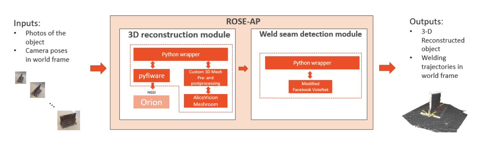

# RoboWeldAR ROSE-AP

[](https://roboweldar-rose-ap.readthedocs.io/en/latest/?badge=latest)
[](https://bestpractices.coreinfrastructure.org/projects/4822)
[](https://www.codacy.com/gh/ikh-innovation/roboweldar-rose-ap/dashboard?utm_source=github.com&amp;utm_medium=referral&amp;utm_content=ikh-innovation/roboweldar-rose-ap&amp;utm_campaign=Badge_Grade)

Coordinator docker build status:


3D reconstruction docker build status:


Weld seam detection docker build status:


[](https://github.com/ramp-eu/TTE.project1/actions?query=workflow%3ACI)
[](https://coveralls.io/github/ramp-eu/TTE.project1?branch=master)


```text

The Badges above demonstrate testing, code coverage
and commitment to coding standards (since the code is linted on commit).

The links need to be amended to point to the correct repo.

Sign up for:

- CI Test system - e.g. GitHub Actions, Travis
- A Documentation website - e.g. ReadTheDocs
- Static Code Analysis tool - e.g. Codacy
- CII Best Practices https://bestpractices.coreinfrastructure.org

Only CII Best Practices (and its badge) is mandatory. Any equivalent public automated tools for the other three may be used.

Note that the CII Best Practices questionaire will request evidence of tooling used.

```

```text
This repository contains the source code to the RoboWeldAR ROSE-AP module. Given a set of photographs of a metallic object destined for welding, this module produces 3D-reconstructed model of that object, along with proposed welding paths.
```

This project is part of [DIH^2](http://www.dih-squared.eu/). For more information check the RAMP Catalogue entry for the
[components](https://github.com/xxx).

| :books: [Documentation](https://roboweldar-rose-ap.readthedocs.io/en/latest/) | :whale: [Docker Hub](https://hub.docker.com/u/roboweldar) |
| --------------------------------------------- | ------------------------------------------------------------- |


## Contents

- [Background](#background)
- [Install](#install)
- [Usage](#usage)
- [API](#api)
- [Testing](#testing)
- [License](#license)

## Background

This repository contains the source code to the RoboWeldAR ROSE-AP module. Given a set of photographs of a metallic object destined for welding, this module produces 3D-reconstructed model of that object, along with proposed welding paths. The ROSE-AP building block is one of the functional cores of the RoboWeldAR system (along with the robotic control module), and encapsulates the 3D reconstruction and weld seam detection components.



- Inputs: An array of photos from different angles, camera pose for each photo 

- Outputs: 3D reconstructed object, welding trajectories (paths and poses) that represent where welding targets should be welded and how they should be approached.

- Description: The most time-consuming part of the RoboWeldAR workflow is the 3-D reconstruction, which is why in our implementation we have developed a logger which broadcasts updates to the Orion Context Broker in NGSIv2 format, so that the user can monitor the progress. This ROSE-AP will be of interest to manufacturing entities that already use robotic welding processes in their workflow. The only modification to the hardware required is the addition of an off-the-shelf RGB camera, and a way to collect robot pose for each photograph capture so that it can be provided to the ROSE-AP component. After the output is produced and sent back to the end user, the end user must provide a way to provide the produced welding trajectory to their robot. As long as the robot frame has not been translated or rotated between the photo capture and welding processes, the welding trajectory will remain valid and ready for utilization.

## Install

Information about how to install the component can be found at the corresponding section of the
[Installation & Administration Guide](docs/installationguide.md).

A `Dockerfile` is also available for your use - further information can be found [here](docker/README.md)

## Usage

Information about how to use the component can be found in the [User & Programmers Manual](docs/usermanual.md).

The following features are listed as [deprecated](docs/deprecated.md).

## API

Definition of the API interface:

Information about the API of  the component can be found in the [API documentation](docs/api.md).

## Testing

For performing a basic end-to-end test, you have to follow the steps detailed in the [Test documentation](docs/tests.md).

## License

[Apache](LICENSE) © IKH 2021
