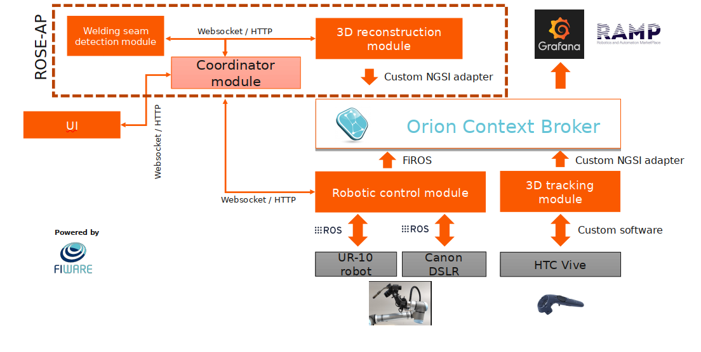

# RoboWeldAR ROSE-AP Architecture

The ROSE-AP component encapsulates three services: 

- [Coordinator service (networking module)](https://github.com/ikh-innovation/roboweldar-networking/)
- [3D reconstruction service](https://github.com/ikh-innovation/roboweldar-3d-reconstruction/)
- [Weld seam detection service](https://github.com/ikh-innovation/roboweldar-weld-seam-detection/)

The above three services are connected internally in the following manner:

The ROSE-AP block is what the present repository contains. It can be easily interfaced to the entirety of the RoboWeldAR system via the coordinator module.
