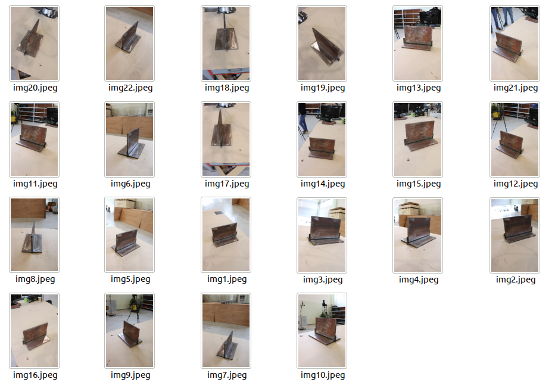

# Welcome to the RoboWeldAR ROSE-AP component documentation

The RoboWeldAR ROSE-AP component is a software module that enables cognitive robotic welding for agile manufacturing. Given a set of photographs of a metallic object destined for welding, this module produces 3D-reconstructed model of that object, along with proposed welding paths. The ROSE-AP building block is one of the functional cores of the RoboWeldAR system (along with the robotic control module), and encapsulates the 3D reconstruction and weld seam detection components.

| Image dataset | 3D reconstructed model + proposed seams |
|---------------|-----------------------------------------|
|          |           |

Github's [README.md](README.md) provides a good documentation summary. The [Installation & Administration Guide](installationguide.md), [User & Programmers Manual](usermanual.md) and [Test documentation](test_examples.md) cover more advanced topics.
