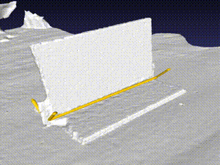
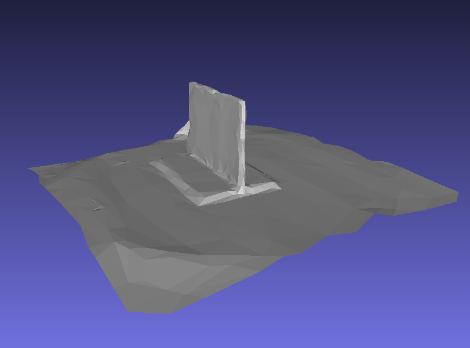
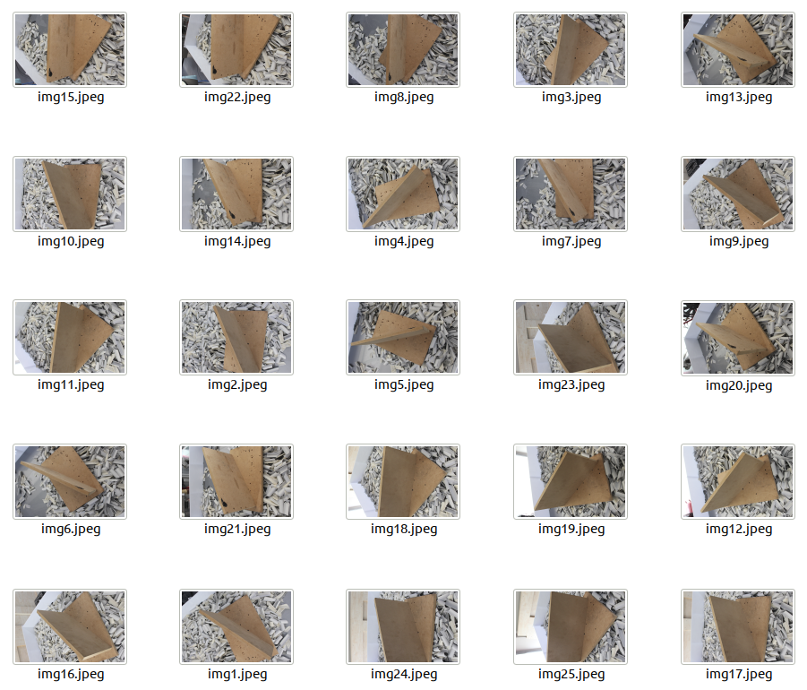
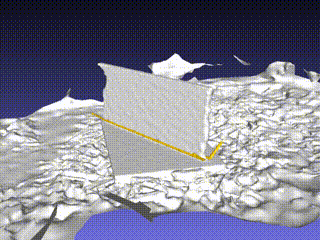

# User Manual

## Test examples

### Directory structure

The directories `test/example_files*` each contain the following folders:

- `raw`: this folder contains a number of photographs taken around the periphery of a steel welding target. For each image, it also contains the corresponding robot pose (in the world frame) at the time the photograph was taken, in `.npy` format. A human readable `poses.txt` file is included, where each row corresponds to a flattened augmented rotation matrix of 12 elements (9 rotation values, 3 position values). The `camera.yaml` file contains the camera intrinsics.

- `mesh`: This folder contains the output of the 3d reconstruction module, which is the transformed mesh with respect to the robot's coordinate system (world). `mesh` is the standard output of the photogrammetry pipeline (omitted here), while `transformed_mesh` is the output of the transformation pipeline. This folder contains `.mtl`, `.obj` and `.png` files.

- `welding_trajectory`: This folder contains the results of the weld seam detection module. `simplified_mesh.obj` is the result of simplifying th emesh to a maximum number of 400 triangles, and is useful for path planning, as the few number of elements reduces the computational time for arriving at a solution. `welding_paths.npy` contains the detected welding seams in the form of a numpy data structure, while `trajectories_mesh.obj` contains the 3-D representation of the latter. 

A total of three examples have been compiled.

### Example 1

| Image dataset | 3D reconstructed model + proposed seams | Simplified 3D model |
|---------------|-----------------------------------------|---------------------|
|               |                                        |                     |


### Example 2

| Image dataset | 3D reconstructed model + proposed seams | Simplified 3D model |
|---------------|-----------------------------------------|---------------------|
|               |                                        |                     |


## Cloning the repository

```bash
git clone --recursive git@github.com:ikh-innovation/roboweldar-rose-ap.git
```

Since the submodules in this repository were added using SSH, you will need to have SSH access enabled on your Github account to fully clone this repository.


## Running the component instance

### Setting up your dependencies

First, make sure you have installed the docker Nvidia driver:

```bash
cd docker
sudo chmod a+x docker_cuda_install_script.sh
./docker_cuda_install_script.sh
```

Then, we set up the services by starting our docker containers. Run

```bash
sudo chmod a+x entrypoint.sh
./entrypoint.sh
```

This will create folders in the `docker` dir, which allow you to peek into each container's state. This is helpful because you may want to manually inspect files, or copy them over to your host manually. Now that the services are up and running, we can move on to interacting with them.

From the repository root, run

```bash
cd src
python3.7 -m virtualenv .venv
source .venv/bin/activate
pip install -r roboweldar_networking/interfaces/requirements.txt
```

Now you should have the required packages installed in the Python venv on your host, so that you can proceed with running the example. 


### Running the 3-D reconstruction module

In the same terminal, run 

```bash
python run_3d_reconstruction.py
```

This script uses the `roboweldar-coordinator` REST API to transmit robot pose and photo data residing in the [raw data](../test/example_files/raw) directory to the `roboweldar-3d-reconstruction` service, which will fetch these files from the `roboweldar-coordinator` filesystem and start computations on them to produce a 3D reconstructed model. The result will be placed in the newly created (created on runtime) `docker/roboweldar-networking/mesh/` directory.

To fetch it via the API, use the following function in the [roboweldar-networking](https://github.com/ikh-innovation/roboweldar-networking/blob/b2322131baeab5870961acaf77151bb8c2f0ba14/interfaces/template.py#L70) module:

```python
get_mesh_files(host, httpPort, path_to_dir, mesh_files)
```
Alternatively, you can manually navigate to the `docker/roboweldar-networking/mesh/` and inspect the files.

### Running the weld seam detection module

In the same terminal, run 

```bash
python run_weld_seam_detection.py
```

This script uses the `roboweldar-coordinator` REST API to transmit a message to the `roboweldar-weld-seam-detection` service, which will fetch the previously reconstructed mesh file from the `roboweldar-coordinator` filesystem and start computations to produce welding trajectories(as npy and mesh datatypes). The result will be placed in the newly created (created on runtime) `docker/roboweldar-networking/welding_trajectory/` directory.

To fetch it via the API, use the following functions in the [roboweldar-networking](https://github.com/ikh-innovation/roboweldar-networking/blob/b2322131baeab5870961acaf77151bb8c2f0ba14/interfaces/template.py#L70) module:

```python
get_mesh_files(host, httpPort, path_to_dir, mesh_files)
get_trajectory_file(host, httpPort, path_to_dir, trajectory_file_name)
```
Alternatively, you can manually navigate to the `docker/roboweldar-networking/welding_trajectory/` and inspect the files.


