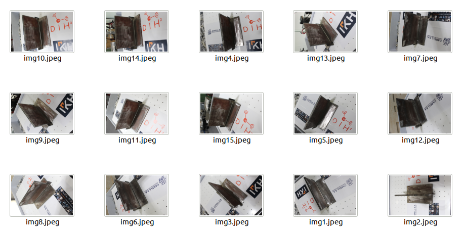
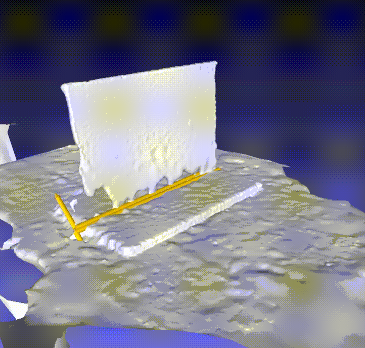
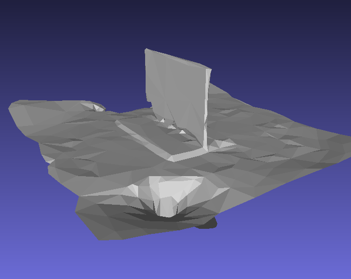

## Test examples

### Directory structure

The directories `test/example_files*` each contain the following folders:

- `raw`: this folder contains a number of photographs taken around the periphery of a steel welding target. For each image, it also contains the corresponding robot pose (in the world frame) at the time the photograph was taken, in `.npy` format. A human readable `poses.txt` file is included, where each row corresponds to a flattened augmented rotation matrix of 12 elements (9 rotation values, 3 position values). The `camera.yaml` file contains the camera intrinsics.

- `mesh`: This folder contains the output of the 3d reconstruction module, which is the transformed mesh with respect to the robot's coordinate system (world). `mesh` is the standard output of the photogrammetry pipeline (omitted here), while `transformed_mesh` is the output of the transformation pipeline. This folder contains `.mtl`, `.obj` and `.png` files.

- `welding_trajectory`: This folder contains the results of the weld seam detection module. `simplified_mesh.obj` is the result of simplifying th emesh to a maximum number of 400 triangles, and is useful for path planning, as the few number of elements reduces the computational time for arriving at a solution. `welding_paths.npy` contains the detected welding seams in the form of a numpy data structure, while `trajectories_mesh.obj` contains the 3-D representation of the latter. 

A total of three examples have been compiled.

### Example 1 (good)

| Image dataset | 3D reconstructed model + proposed seams | Simplified 3D model |
|---------------|-----------------------------------------|---------------------|
|               |                                       |                      |

This example dataset consists of 22 images and associated pose files. The object is fairly reflective, but less so than Example 3. The resulting quality of reconstruction is thus acceptable, and the proposed welding seams were detected reliably.

### Example 2 (good)

| Image dataset | 3D reconstructed model + proposed seams | Simplified 3D model |
|---------------|-----------------------------------------|---------------------|
|               |                                       |                      |

This example dataset consists of 25 images and associated pose files. The mock object is not reflective (wood) which improves the quality of reconstruction. The proposed welding seams have been detected reliably. 

### Example 3 (bad)

| Image dataset | 3D reconstructed model + proposed seams | Simplified 3D model |
|---------------|-----------------------------------------|---------------------|
|               |                                       |                      |

This example dataset consists of 15 images and associated pose files. The object appears reflective in the photos which adversely affects the quality of reconstruction. This has a direct effect on the reliability of the proposed welding seams. 

